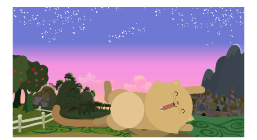
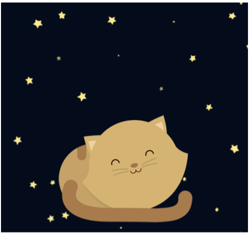
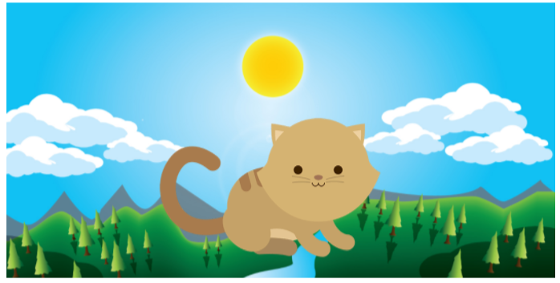
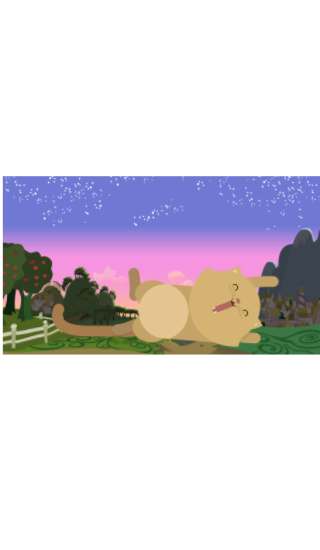
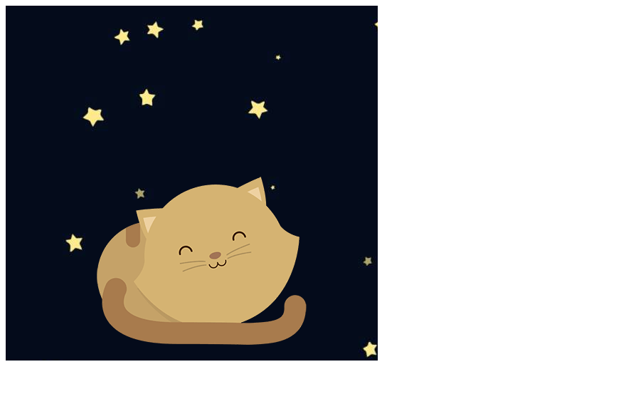
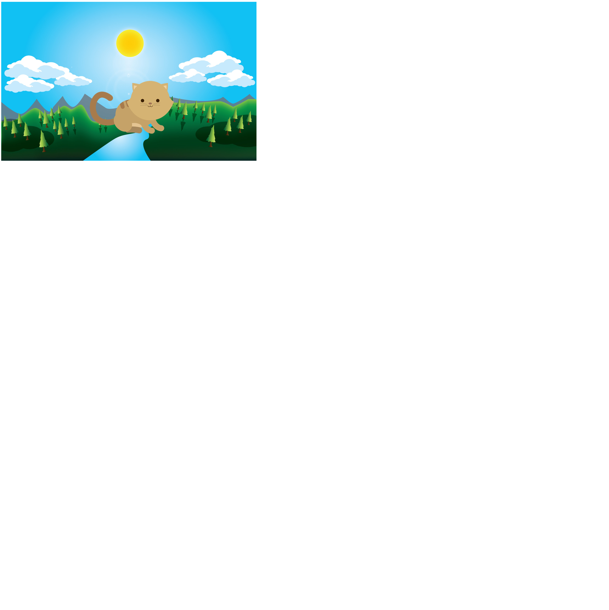

## RETO: "KITTEN" ##

__1) Objetivos:__

 Nos piden para este reto replicar las siguientes imágenes de forma que se adapte a distintos tipos de dispositivos:

 * móvil:

 * tablet:

 * laptop:

 Que en mi caso son los dispositivos que escogí.

 __2)Desarrollo:__

  2.1) *Versión móvil*

* Ingresé una sección para cada imagen por lo que para está primera parte es la sección mobile.

* Utilicé un div para ingresar la imagen de fondo con css luego ingreso la imagen del gato la cual queda sobrepuesta pero posicionamos utilizando propiedades en css .

* Por último utilizo media querie para ingresar la condiconal que cuando la pantalla tenga un ancho de hasta 768px pueda ser visible en un 100% ,handheld es un media type utilizado para móviles por eso lo ingresé ya que mas adelante ingresaremos otros queries para otros tipos de dispositivos.

   obtengo lo siguiente:

   

  2.2) *versión tablet*

* De la misma forma ingreso otra sección para esta parte será la sección tablet.

* Utilicé un div para ingresar la imagen de fondo con css luego ingreso la imagen del gato la cual queda sobrepuesta pero posicionamos utilizando propiedades en css .

* Por último utilizo media querie para ingresar la condicional que cuando la pantalla tenga un ancho de hasta 992px pueda ser visible en un 100%.

 

 2.3)*versión laptop*

 * De la misma forma ingreso otra sección para esta parte será la sección laptop.

 * Utilicé un div para ingresar la imagen de fondo con css luego ingreso la imagen del gato la cual queda sobrepuesta pero posicionamos utilizando propiedades en css .

 * Por último utilizo media querie para ingresar la condicional que cuando la pantalla tenga un ancho de hasta 1200px pueda ser visible en un 100%.

 
 
